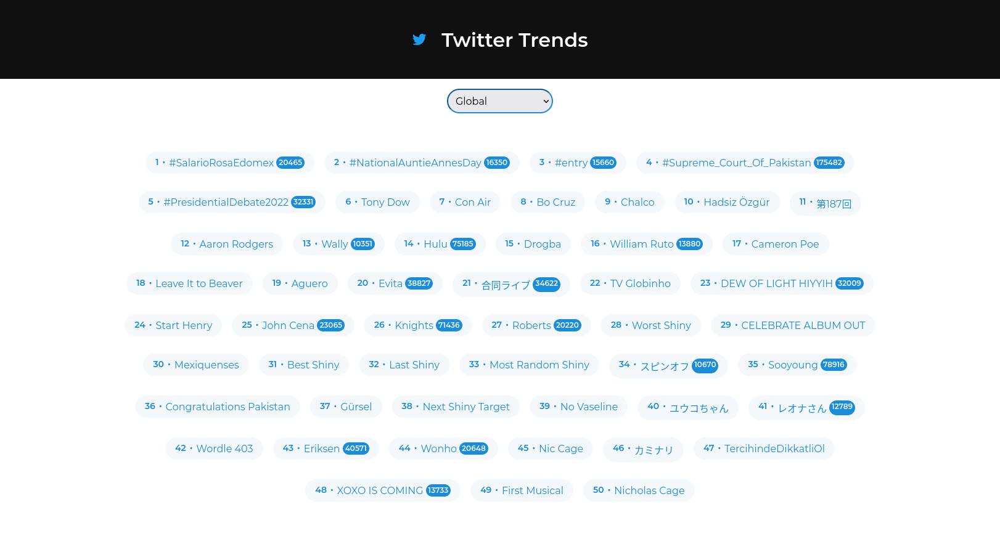

# [Twitter Trends](https://twitter-trends-beryl.vercel.app/)

    
    
    
    
    

  

> NextJS application to get the trends of the moments based on the location selected

## 🚀 How to use the project

### 🛹 Clone the repo

`git clone https://github.com/andreseichi/twitter-trends-next.git`

or

`git@github.com:andreseichi/twitter-trends-next.git`

### 📒 Access the repo

`cd twitter-trends-next`

### 🧭 Install all dependencies with yarn

`yarn`

### 🔨 Build it

`yarn build`

## [Demo](https://twitter-trends-beryl.vercel.app/)
